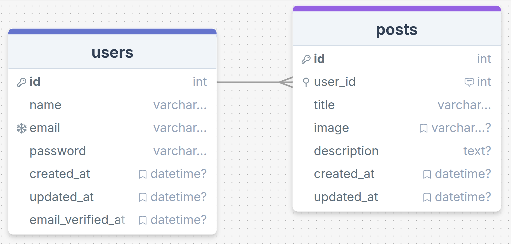

# web-developer-junior
Projeto para avaliação técnica da Vaga para Desenvolvedor Web Júnior

## Stack
- CodeIgniter 4
- Eloquent ORM
- Bootstrap template (Utilizando tailwind para estilizações majoritárias)
- JQuery
- MySQL via Docker
- Git

## Atividade 1
- [X] crie um gerenciador de posts de um blog
- [X] o gerenciador deve possuir login
- [X] o post deve possui nome, foto, descrição em html
- [X] projeto deve ser monolítico ou seja, não separar em front e back

## Atividade 2
- [X] agora crie o blog
- [X] deve possuir uma tela de listagem dos posts com campo de buscar
- [x] e outra tela de destalhes do post

## Informações
- será avaliado a qualidade do código escrito
- bem como sua capacidade de utilizar as tecnologias propostas.
- [x] o banco MySQL precisa ter seu diagrama, pode usar workbench pra isso
- [x] faça um fork desse projeto
- [x] crie uma branch development e depois de terminar o desenvolvimento faça o merge com a main
- [x] depois envie o link do respositorio para vagastmatheaco@gmail.com

## Diagrama
